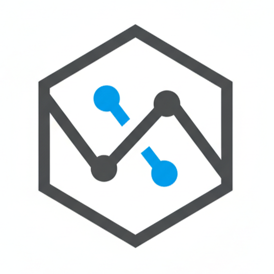
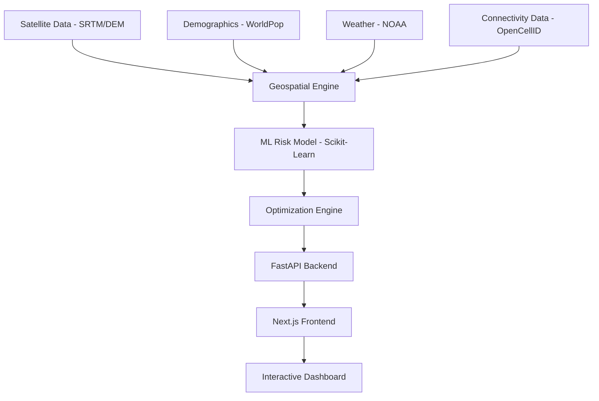
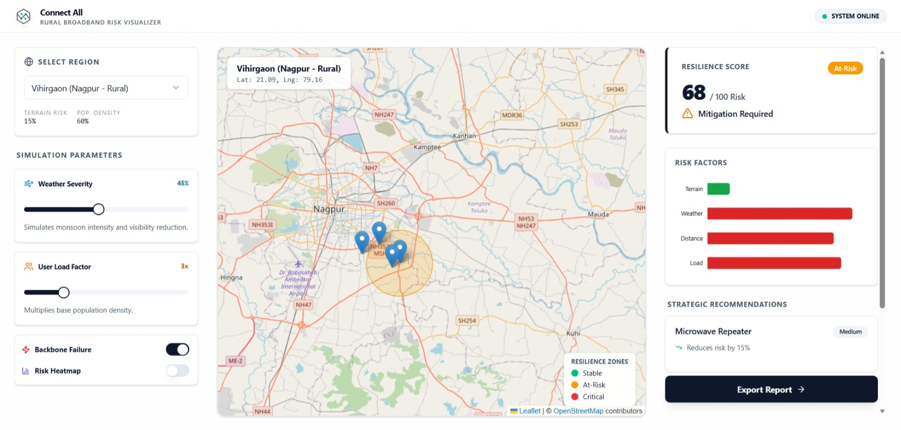

<div align="center">
  
  <h1>Connect All: Rural Broadband Risk Visualizer</h1>
  <p><strong>Predicting resilience and bridging the digital divide using satellite intelligence.</strong></p>

  [](https://nextjs.org/)
  [](https://fastapi.tiangolo.com/)
  [](https://leafletjs.com/)
  [](https://opensource.org/licenses/MIT)
</div>

---

## 🌍 Project Vision

**Connect All** is a zero-cost, software-powered decision platform designed to solve the critical challenge of rural broadband reliability. By integrating real-time satellite imagery, terrain data, and weather volatility, we predict infrastructure failure risks before they happen, enabling proactive network planning in the most remote regions of India.

Aligned with **SDG 9.11 (Engineering Resilient Broadband)**, our mission is to ensure that no village is left behind due to preventable signal fade or suboptimal tower placement.

---

## ✨ Key Features

- **🎯 Predictive Risk Scoring:** ML-driven analytics to identify high-risk zones based on terrain elevation and monsoon volatility.
- **🗺️ Interactive Geospatial Dashboard:** High-fidelity maps powered by Leaflet.js visualizing regional resilience zones.
- **⚡ Live Scenario Simulation:** Stress-test network performance against simulated weather events and peak user loads.
- **🛠️ Smart Infrastructure Recommendations:** Algorithmic placement of relay nodes to maximize coverage with minimal terrain obstruction.
- **📡 Satellite-Terrestrial Hybrid Synthesis:** Data-driven logic to flag optimal paths for hybrid backhaul systems.

---

## 🏗️ System Architecture



---

## 🛠️ Tech Stack

### Frontend
- **Framework:** Next.js (App Router)
- **Maps:** Leaflet.js
- **Animations:** Framer Motion
- **UI Components:** Radix UI + Tailwind CSS
- **State Management:** React Hooks + UseMemo

### Backend
- **Framework:** FastAPI
- **Data Science:** GeoPandas, NumPy, SciPy
- **ML Models:** Scikit-Learn (Random Forest, Gradient Boosting)
- **Raster Processing:** Rasterio

---

## 🚀 Quick Start

### Prerequisites
- Python 3.9+
- Node.js 18+

### 1. Backend Setup
```bash
cd backend
python -m venv venv
# On Windows
.\venv\Scripts\activate 
# On Linux/macOS
source venv/bin/activate

pip install -r requirements.txt
uvicorn app.main:app --reload
```

### 2. Frontend Setup
```bash
cd frontend
npm install
npm run dev
```
## 🌐 Live Demo

Try **Connect All** live and explore rural broadband risk visualization for India:

<div align="center">
  <a href="https://conventional-alpha.vercel.app/" target="_blank">
    
  </a>
  <br><br>
  
  <p><em>Interactive risk heatmap showing high-risk rural zones across Maharashtra</em></p>
</div>

**🔗 Direct Links:**
- 🚀 [Production Demo](https://conventional-alpha.vercel.app/)

---
## 📊 Presentation Slides

**Download the complete pitch deck:**

<div align="center">
  <a href="https://drive.google.com/file/d/1Wz0MSSDj5RDCxsqFNg1dKEkERKqfw8Sp/view?usp=sharing" target="_blank">
    
  </a>
  <br><br>
  <p><strong>Connect All: Rural Broadband Risk Visualizer</strong></p>
  <p><em>Built for CIH3.0 @ 2026 | SDG 9.11</em></p>
</div>

---

**Key Slides Overview:**
| Slide # | Title | Key Visual |
|---------|-------|------------|
| 1 | Problem: Digital Divide | India rural connectivity heatmap [web:1] |
| 5 | Our Solution | Live demo GIF |
| 12 | Tech Architecture | Mermaid diagram (above) |
| 18 | Team & Roadmap | Team table + 2026 milestones |
| 22 | Call to Action | SDG 9.11 impact metrics |

**💡 Pro Tip:** Slides auto-embed video demo and live dashboard link for investor pitches.

---

## 🤝 Team Innoventures

| Member | Role |
| :--- | :--- |
| **Athar Shaikh** | Lead Developer |
| **Sujal Belkhode** | ML Engineer |
| **Kaustubh Chauhan** | Frontend Arch |
| **Kaifoddin Kazi** | Data Analyst |

---

## 📜 License

This project is licensed under the **MIT License**. See the [LICENSE](LICENSE) file for details.

<div align="center">
  <p>Built for CIH3.0 @ 2026</p>
</div>
